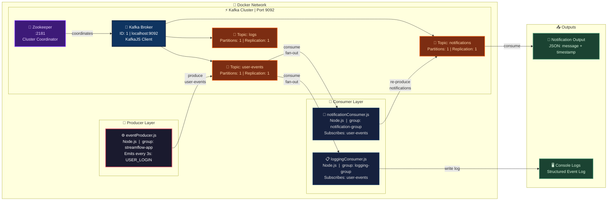

# StreamFlow – Real-Time Basic Event Streaming Platform

A professional, application-oriented Kafka project using Node.js, Zookeeper, and Docker for real-time event streaming.

---

## Overview

StreamFlow is a lightweight event-driven system where services communicate via Kafka. It demonstrates:

* Running Kafka & Zookeeper using Docker
* Creating Kafka topics
* Producing messages from Node.js
* Consuming messages in Node.js
* Real-time event-driven architecture

---

## Tech Stack

* Node.js
* Apache Kafka
* Zookeeper
* Docker & Docker Compose
* KafkaJS library

---
## Architecture

---

## Project Structure

```
streamflow/
│
├── docker-compose.yml
├── .env
├── package.json
│
├── config/
│   └── kafka.js
│
├── producer/
│   └── eventProducer.js
│
├── consumer/
│   ├── notificationConsumer.js
│   └── loggingConsumer.js
│
├── topics/
│   └── createTopics.js
│
├── utils/
│   └── logger.js
│
└── README.md
```

---

## Prerequisites

Make sure you have installed:

* Docker Desktop (running)
* Node.js (v14+ recommended)
* npm

Verify installation:

```powershell
docker --version
node -v
npm -v
```

---

## Docker Compose Setup

Create `docker-compose.yml`:

```yaml
version: '3'

services:
  zookeeper:
    image: confluentinc/cp-zookeeper:latest
    container_name: zookeeper
    environment:
      ZOOKEEPER_CLIENT_PORT: 2181

  kafka:
    image: confluentinc/cp-kafka:latest
    container_name: kafka
    depends_on:
      - zookeeper
    ports:
      - "9092:9092"
    environment:
      KAFKA_BROKER_ID: 1
      KAFKA_ZOOKEEPER_CONNECT: zookeeper:2181
      KAFKA_ADVERTISED_LISTENERS: PLAINTEXT://localhost:9092
      KAFKA_OFFSETS_TOPIC_REPLICATION_FACTOR: 1
```

---

## Environment Variables

Create `.env`:

```
KAFKA_BROKER=localhost:9092
```

---

## Node.js Setup

Initialize project and install dependencies:

```powershell
npm init -y
npm install kafkajs dotenv
```

---

## Kafka Configuration

`config/kafka.js`:

```javascript
const { Kafka } = require('kafkajs');
require('dotenv').config();

const kafka = new Kafka({
    clientId: 'streamflow-app',
    brokers: [process.env.KAFKA_BROKER]
});

module.exports = kafka;
```

---

## Create Topics

`topics/createTopics.js`:

```javascript
const kafka = require('../config/kafka');

async function createTopics() {
    const admin = kafka.admin();
    await admin.connect();

    await admin.createTopics({
        topics: [
            { topic: 'user-events', numPartitions: 1 },
            { topic: 'notifications', numPartitions: 1 },
            { topic: 'logs', numPartitions: 1 }
        ]
    });

    console.log('Topics created');
    await admin.disconnect();
}

createTopics();
```

---

## Producer: eventProducer.js

`producer/eventProducer.js`:

```javascript
const kafka = require('../config/kafka');

const producer = kafka.producer();

async function run() {
    await producer.connect();

    let count = 0;

    setInterval(async () => {
        const event = {
            id: count++,
            type: 'USER_LOGIN',
            user: `user_${count}`,
            timestamp: new Date().toISOString()
        };

        await producer.send({
            topic: 'user-events',
            messages: [{ value: JSON.stringify(event) }]
        });

        console.log('Produced:', event);
    }, 3000);
}

run();
```

---

## Consumer: notificationConsumer.js

`consumer/notificationConsumer.js`:

```javascript
const kafka = require('../config/kafka');

const consumer = kafka.consumer({ groupId: 'notification-group' });
const producer = kafka.producer();

async function run() {
    await consumer.connect();
    await producer.connect();

    await consumer.subscribe({ topic: 'user-events' });

    await consumer.run({
        eachMessage: async ({ message }) => {
            const event = JSON.parse(message.value.toString());

            const notification = {
                message: `User ${event.user} logged in`,
                time: event.timestamp
            };

            await producer.send({
                topic: 'notifications',
                messages: [{ value: JSON.stringify(notification) }]
            });

            console.log('Notification created:', notification);
        }
    });
}

run();
```

---

## Consumer: loggingConsumer.js

`consumer/loggingConsumer.js`:

```javascript
const kafka = require('../config/kafka');

const consumer = kafka.consumer({ groupId: 'logging-group' });

async function run() {
    await consumer.connect();

    await consumer.subscribe({ topic: 'user-events' });

    await consumer.run({
        eachMessage: async ({ message }) => {
            const event = JSON.parse(message.value.toString());
            console.log('Log:', event);
        }
    });
}

run();
```

---

## Utility: Logger

`utils/logger.js`:

```javascript
function log(message) {
    console.log(`[${new Date().toISOString()}] ${message}`);
}

module.exports = log;
```
---

## Running the Project

```powershell
# Start Kafka and Zookeeper
docker-compose up -d

# Install Node.js dependencies
npm install

# Create Kafka topics
npm run create:topics

# Start services in separate terminals
npm run start:logging
npm run start:notification
npm run start:producer
```

---

## Notes

* Default Kafka port: 9092
* Zookeeper port: 2181
* Ensure Docker is running before starting services
* KafkaJS is production-ready, `kafkajs` is used instead of `kafka-node`

---

## Future Improvements

* Add Express API → Kafka pipeline
* Add React dashboard (real-time UI)
* Integrate Redis caching
* Add PostgreSQL storage
* Implement multi-partition topics & consumer groups

---

## License

MIT License