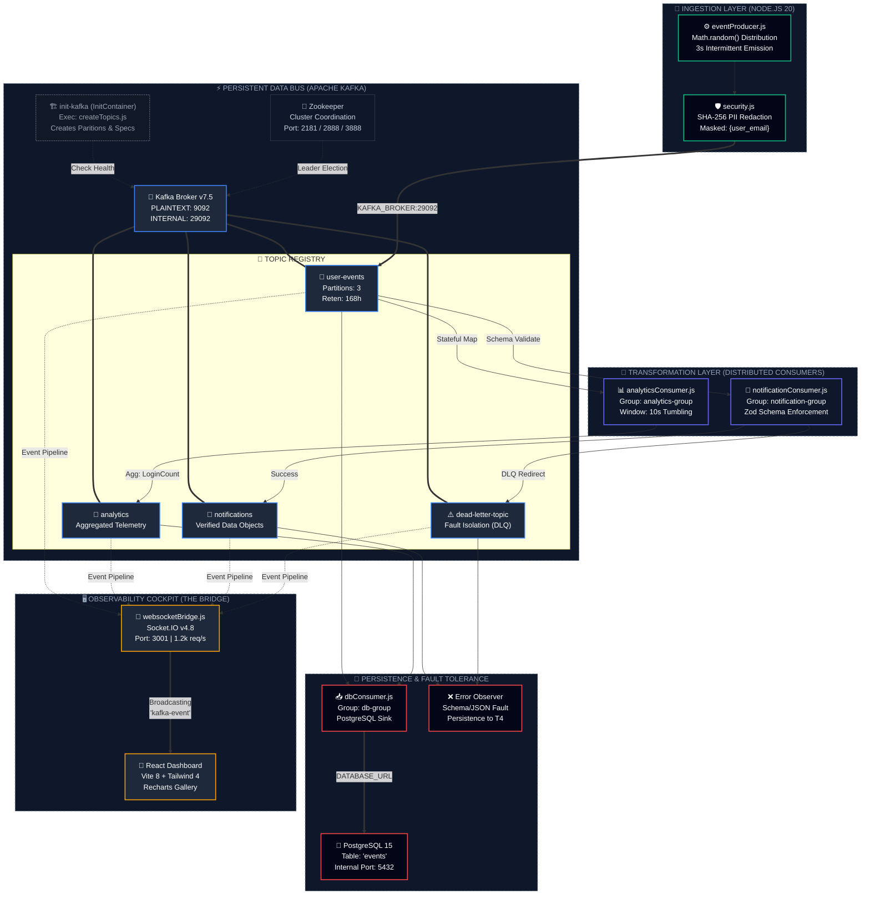
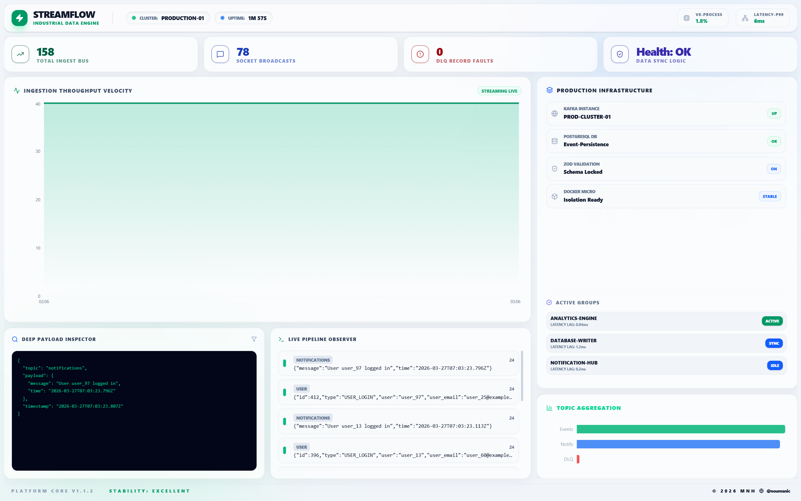
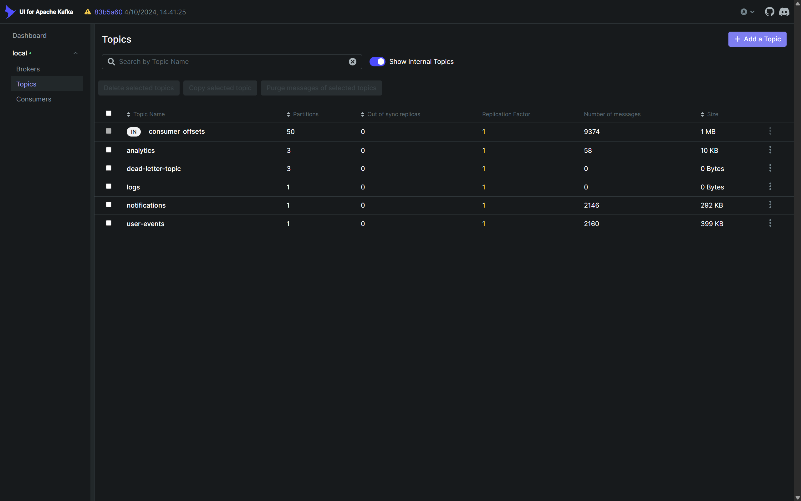
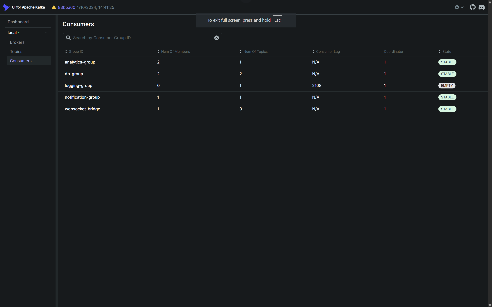
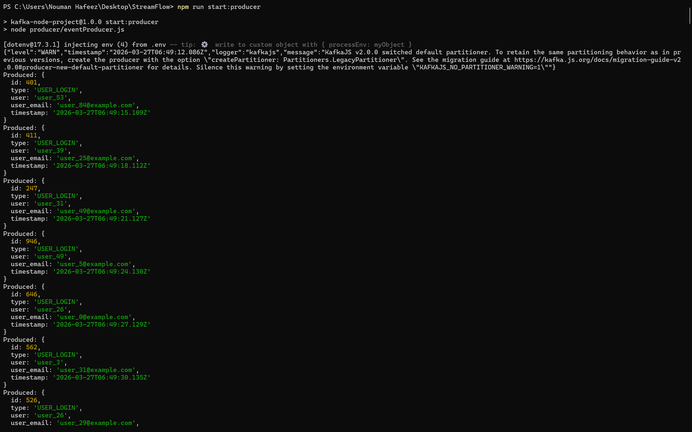
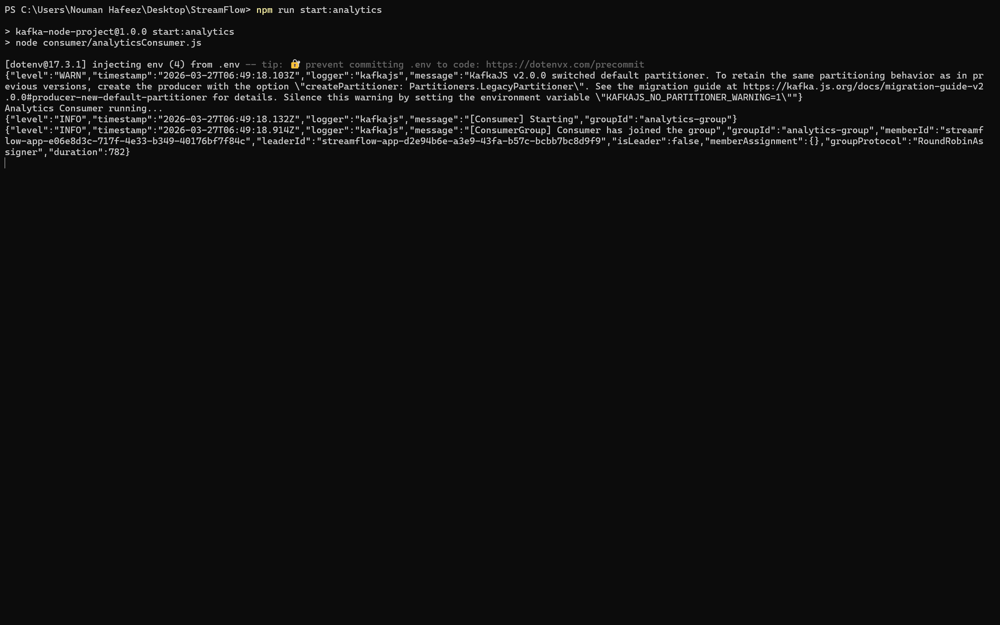
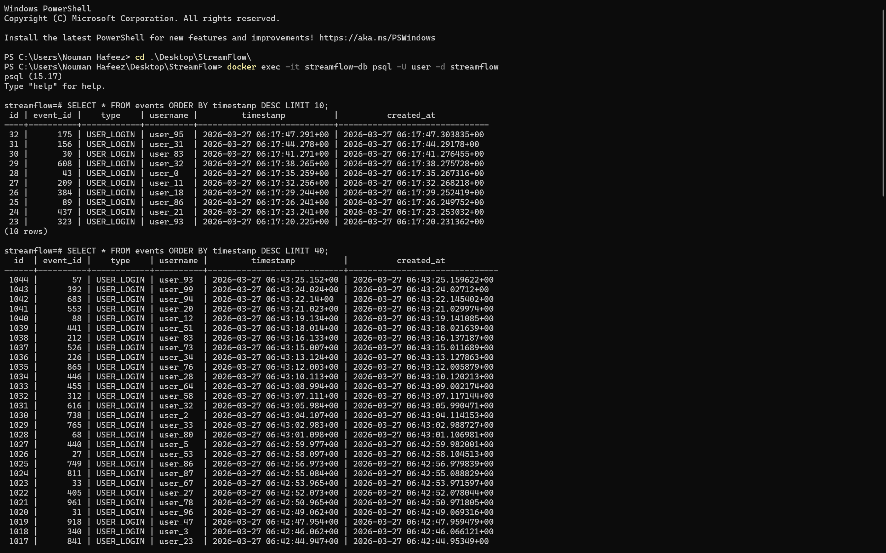

# StreamFlow – Professional Data Engineering Pipeline 🚀

StreamFlow is a event streaming platform designed to demonstrate the complete **Data Engineering Lifecycle**. It transitions from simple message passing to a managed, resilient ecosystem following industry best practices.

---

## 🏛️ System Architecture



---

## 🧬 The Data Engineering Lifecycle (DELC) Implementation

StreamFlow implements the industry-standard **Data Engineering Lifecycle** with high-fidelity practices at every stage:

### 1. 🏗️ Generation (Source)
- **High-Velocity Simulation:** `eventProducer.js` generates standardized JSON login events.
- **Undercurrent: Security:** In-transit **Data Masking** (SHA-256) redacts sensitive `user_email` patterns before they enter the stream.

### 2. 📥 Ingestion
- **Resilient Transport:** Apache Kafka acts as the decoupled, durable intake buffer.
- **Architectural Scaling:** Configured with **3 Partitions** per topic to enable parallel ingestion and high-throughput ingestion.

### 3. ⚡ Transformation
- **Stateful Processing:** `analyticsConsumer.js` performs **Tumbling Window** aggregations (10s intervals).
- **Undercurrent: Data Management:** **Zod Schema Validation** creates a strict data contract; invalid payloads are routed to a **Dead Letter Queue (DLQ)**.

### 4. 💾 Storage
- **Relational Persistence:** `dbConsumer.js` sinks validated events into **PostgreSQL 15**.
- **Structured Schema:** Hardened table definitions ensure consistent historical data retrieval.

### 5. 🚀 Serving
- **Real-Time Delivery:** **WebSocket Bridge** (Socket.io) serves as the presentation layer.
- **Observability Cockpit:** A high-end **React Dashboard** provides live observability of the entire pipeline velocity.

---

## 🛠️ Tech Stack
- **Streaming:** Apache Kafka, Zookeeper
- **Backend:** Node.js, Express, Socket.io, KafkaJS
- **Frontend:** React, Vite, TailwindCSS v4, Recharts
- **Database:** PostgreSQL 15
- **Tools:** Docker, Jest, Zod, Framer-motion

---

## 📊 Visual Platform Walkthrough

### 💎 High-Density Operational Cockpit
The StreamFlow dashboard provides real-time throughput velocity, deep-payload inspection, and infrastructure health monitoring.


### ⚡ Kafka Infrastructure & Topic Management
Full visibility into the 3-partition scaling and message distribution via Kafka-UI.



### 🛰️ Real-Time Pipeline Terminals
Observation of the end-to-end data flow: Producer -> Analytics -> Bridge -> DB.




---

## 🚀 Getting Started

### 1. Start Infrastructure
```bash
docker-compose up -d
```

### 2. Launch Dashboard
```bash
cd dashboard && npm run dev
```

### 3. Start Pipeline
```bash
npm run create:topics
npm run start:producer
npm run start:analytics
npm run start:db
npm run start:bridge
```

---

## 🏗️ Detailed Micro-Architecture Specifications

To ensure the platform is enterprise-ready, the following precise network and service specifications are implemented:

| Component | Technology | Internal Port | External Port | Role |
| :--- | :--- | :--- | :--- | :--- |
| **Broker** | Apache Kafka 7.5 | `29092` | `9092` | Distributed Event Log |
| **Coordinator** | Zookeeper | `2181` | - | Cluster State Manager |
| **Persistence** | PostgreSQL 15 | `5432` | `5432` | Historical Sink |
| **Bridge** | Express + Socket.IO | `3001` | `3001` | WebSocket Telemetry |
| **Dashboard** | React + Vite | `5173` | `5173` | Observability Cockpit |
| **Monitoring** | Kafka-UI | `8080` | `8080` | Cluster Management |

### 🛰️ Service Discovery & Orchestration
The environment uses a robust **Init-Container pattern**:
1.  **Stage 1:** `db` and `kafka` services initiate with health checks.
2.  **Stage 2:** `init-kafka` executes topic creation (3 Partitions) and waits for cluster availability.
3.  **Stage 3:** Operational microservices (`producer`, `analytics`, `bridge`, etc.) start only after Stage 2 success, preventing race conditions and partial failures.

---

### 📊 DataOps & Observability
- **Platform Health:** Automated service health checks and 24/7 Kafka monitoring via **Kafka-UI**.
- **Real-Time Telemetry:** Millisecond-latency tracking via the **Socket.IO Bridge** and **Payload Inspector**.

### 🛠️ DevOps & Infrastructure
- **Orchestration:** Fully containerized setup with **Docker Compose** managing the microservices mesh.
- **CI/CD:** **GitHub Actions** pipeline for automated build validation and regression testing.

### 🧪 Quality Assurance
- **Automated Testing:** Comprehensive **Jest** suite covering PII masking and Zod schema contracts.
- **Fault Isolation:** **Dead Letter Queue (DLQ)** prevents upstream data corruption.

---

## 📜 License
© 2026 MNH (@noumanic). Licensed under the MIT License.